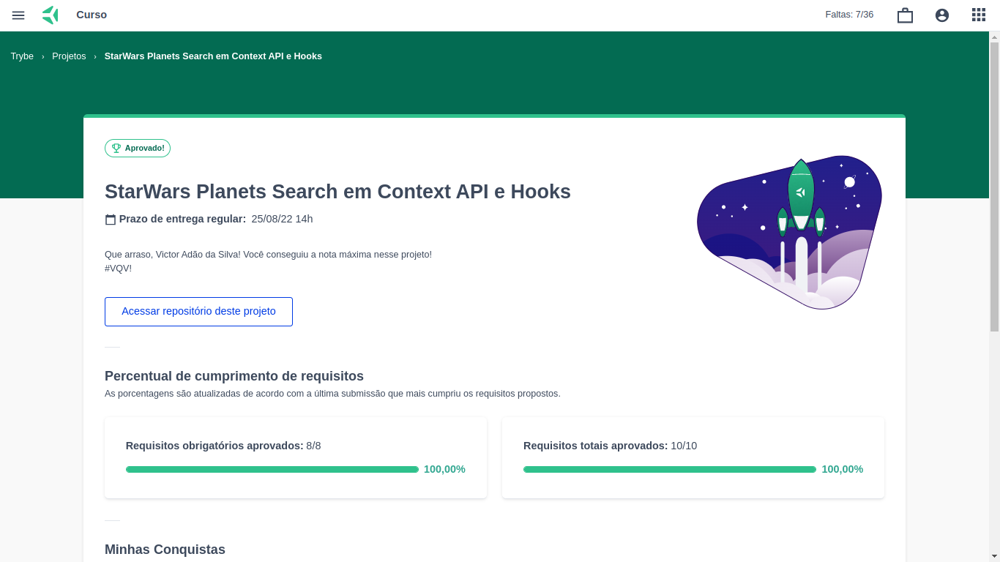

# StarWars-ContextApi

🔰Como iniciar o projeto na sua máquina🔰

- ``` git clone git@github.com:VictorSilva27/StarWars-ContextApi.git ``` (Clonar o repositório no local)
- ``` cd StarWars-ContextApi ``` (Entrar no repositório clonado)
- ``` npm install ``` (Baixando as dependências)
- ``` npm start ``` (Iniciando projeto)

### Nota do Projeto

